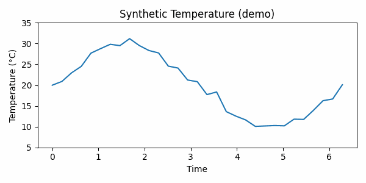

# Weather Intelligence Pipeline

 

This repository contains a demo SaaS-style Weather Intelligence Pipeline built with Apache Airflow, Google BigQuery and the Open-Meteo API. It demonstrates an end-to-end ETL flow (Extract → Transform → Load), basic schema validation, and a reproducible local development setup using Docker Compose.

## Key Features

- Airflow DAGs for scheduling and orchestration
- BigQuery loader with dataset/table creation
- Data transformers using pandas
- Demo notebook and a script to generate a short GIF for visualization
- Built-in test workflow and CI

## Project Structure

```
weather-intelligence-pipeline/
├── dags/                              # Apache Airflow DAGs
├── pipeline/                          # ETL components (extract, transform, load)
├── config/                            # Schemas and region configs
├── sql/                               # BigQuery SQL transformations
├── tests/                             # Unit and integration tests
├── scripts/                           # Helpful scripts (setup, demo tools)
├── docker/                            # Docker image and entrypoint
├── docker-compose.yml                 # Local stack (Airflow + Postgres)
├── requirements.txt                   # Runtime dependencies
├── requirements-dev.txt               # Dev/test dependencies
├── .env.example                       # Environment variables template
└── README.md                          # This file
```

## Quickstart (local with Docker)

1. Copy the example environment file and set your GCP credentials:

```bash
cp .env.example .env
# Edit .env: set GCP_PROJECT_ID, GCP_KEY_PATH and GCP_REGION
```

2. Build and start the local stack:

```bash
docker-compose up -d --build
```

3. Create an Airflow admin user (if needed):

```bash
docker-compose exec airflow-webserver airflow users create \
  --username admin --password admin --firstname Admin --lastname User --role Admin --email admin@example.com
```

4. (Optional) Prepare BigQuery datasets and tables:

```bash
pip install -r requirements.txt
python scripts/setup_bigquery.py
```

## Demo & Visuals

- Open `notebooks/demo.ipynb` for a minimal interactive demo using synthetic data.
- Generate a short GIF illustrating sample time-series with:

```bash
pip install -r requirements-dev.txt
python scripts/generate_demo_gif.py
```

Visuals

- Demo GIF (generated):

  

- Example screenshots (placeholders). To include real screenshots, run the stack and save images into `artifacts/`:

  - `artifacts/airflow.png` — Airflow DAG Graph/Tree view
  - `artifacts/bigquery_table.png` — BigQuery table preview

  Example command to capture a screenshot on Windows (PowerShell):

  ```powershell
  # Open the UI and capture screenshot manually, or use a tool like nircmd / ShareX
  # Then save to artifacts/airflow.png and artifacts/bigquery_table.png
  ```

## Tests and CI

Run tests locally:

```bash
pip install -r requirements-dev.txt
pytest -q
```

A GitHub Actions workflow is included at `.github/workflows/ci.yml` to run tests on push and PRs.

## Setup Checklist

- [ ] Clone the repository
- [ ] Copy `.env.example` to `.env` and configure GCP credentials
- [ ] Run `gcloud auth login` (GCP authentication)
- [ ] Run `make docker-build && make docker-up`
- [ ] Access Airflow at `http://localhost:8080`
- [ ] Run `python scripts/setup_bigquery.py`
- [ ] Run `make test` to validate
- [ ] Trigger the `weather_etl_daily` DAG manually
- [ ] Inspect data in BigQuery
- [ ] Customize `config/regions.yaml` with your regions

## Advanced Configuration

### Add a New Region

1. Edit `config/regions.yaml`:

```yaml
- name: "Brasilia"
  latitude: -15.8267
  longitude: -47.8711
  region_code: "DF"
  user_segment: "metropolitan"
```

2. Update the DAG to iterate regions (example):

```python
# dags/weather_etl_dag.py (future versions)
regions = load_regions_from_yaml()
for region in regions:
    # create tasks dynamically
```

### Change Pipeline Frequency

```python
# dags/weather_etl_dag.py
schedule_interval="0 */6 * * *"  # every 6 hours
schedule_interval="0 12 * * *"   # daily at noon
schedule_interval="0 0 * * MON"  # every Monday
```

### Enable Alerts

```python
# dags/weather_etl_dag.py
default_args = {
    "email_on_failure": True,
    "email": ["your-email@company.com"],
}
```

## Monitoring

### BigQuery Logs

```sql
-- Recent load jobs
SELECT
  creation_time,
  project_id,
  dataset_id,
  table_id,
  TIMESTAMP_MILLIS(load_time) as load_duration_ms
FROM `project.region-us.INFORMATION_SCHEMA.JOBS_BY_PROJECT`
WHERE job_type = 'LOAD'
ORDER BY creation_time DESC
LIMIT 10
```

### Airflow Logs

```bash
# Real-time logs
docker-compose logs -f airflow-scheduler

# Logs for a specific task
docker-compose logs airflow-webserver | grep extract_weather
```

## Troubleshooting

### Error: "No module named 'pipeline'"

```bash
# Add to PYTHONPATH
export PYTHONPATH="${PYTHONPATH}:/path/to/weather-intelligence-pipeline"

# Or in docker-compose.yml (already configured)
PYTHONPATH=/opt/airflow:/opt/airflow/pipeline
```

### Error: "Google Cloud credentials not found"

```bash
# Configure credentials
gcloud auth application-default login

# Or point to a key file
export GOOGLE_APPLICATION_CREDENTIALS=/path/to/gcp-key.json
```

### DAG does not appear in Airflow

```bash
# Check Python syntax
python -m py_compile dags/weather_etl_dag.py

# Restart scheduler
docker-compose restart airflow-scheduler
```

## Resources

- **Open-Meteo API**: https://open-meteo.com
- **Apache Airflow Docs**: https://airflow.apache.org
- **BigQuery SQL Docs**: https://cloud.google.com/bigquery/docs
- **Great Expectations**: https://greatexpectations.io
---

If you have questions or suggestions, please open an issue or discussion.

## Installation: local vs Docker

- For light local development (scripts, transformer, tests): use `requirements.txt` (lighter, without Airflow/GCP).
- To run the full stack (Airflow + BigQuery providers) use Docker — the container uses `requirements-docker.txt`.

Recommended commands:

```bash
# Local dev (venv)
python -m venv .venv
source .venv/bin/activate   # macOS / Linux
.venv\Scripts\activate     # Windows Powershell
pip install -r requirements.txt

# Build and start stack via Docker (recommended for Airflow)
make docker-build
make docker-up
```

If you encounter issues installing heavy packages on Windows (e.g. `apache-airflow` or `google-cloud-*`), prefer the Docker option.
